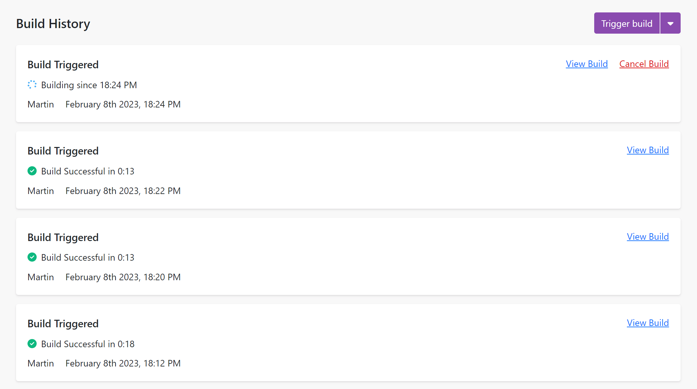
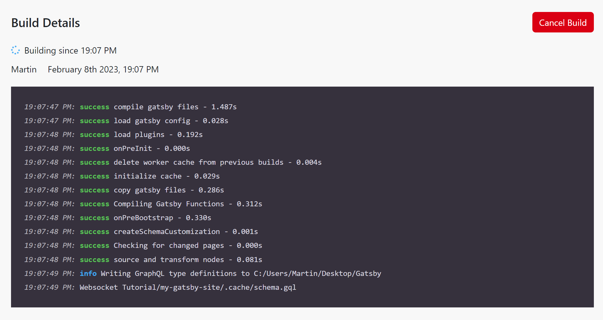
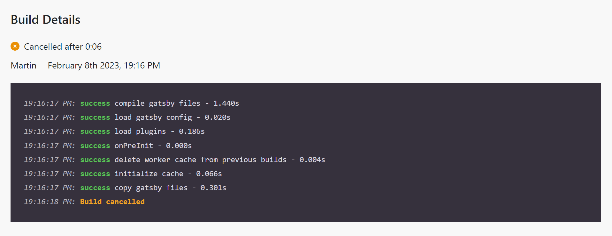

# Real-time Gatsby Build Monitoring with React and WebSockets

This is a demo project for a blog post I wrote about using React and WebSockets to monitor the progress of a Gatsby build.

The blog post can be found here: [Real-time Gatsby Build Monitoring with React and WebSockets](https://medium.com)



## Table of Contents

- [Features](#features)
- [Prerequisites](#prerequisites)
- [Getting Started](#getting-started)
- [List of Builds Page](#list-of-builds-page)
- [Build Details Page](#build-details-page)
- [Contributing](#contributing)

## Features

- Showing the status of the ongoing build
- Providing the status of past builds
- Presenting logs of the build process
- Queuing builds for processing in order
- Canceling builds that are in progress or waiting in the queue.

## Prerequisites

This project requires the WebSockets server that has been built before. You can find the code for that server here: [Gatsby Build Monitor Server](https://github.com/martinholecekmax/gatsby-websocket-api). You will need to run that server before you can run this project.

Other than that, you will need to have the Gatsby Project that you want to monitor set up on your machine which has been described in the WebSocket server project.

This project has been built by using the [Vite](https://vitejs.dev/) tool that has been replacing the `create-react-app` tool.

## Getting Started

Firstly, you will need to create a `.env` file at the root of the project. This file will contain the URL of the WebSocket server that you will be using. The file should look like this:

```
VITE_API_URL=http://localhost:3001
```

You will need to change the URL to match the URL of your WebSocket server.

Next, you will need to install the dependencies of the project by running the following command:

```bash
npm install
```

Once the dependencies have been installed, you can run the project by running the following command:

```bash
npm run dev
```

This will start the project and you should see the list of builds that have been processed so far if you have any.

## List of Builds Page

The list of builds page is the main page of the project. It shows the list of builds that have been processed so far and the status of the current build in real-time. The builds are added to the queue and processed one by one.


By clicking on the `Trigger Build` button, you can trigger a new build. The build will be added to the queue and processed one by one.

You can also run the build with the cache cleared by clicking on the dropdown menu next to the `Trigger Build` button and selecting the `Clear Cache` option.

The builds that are currently in progress or waiting in the queue can be canceled by clicking on the `Cancel Build` button.

## Build Details Page

The build details page shows the details of a specific build. It shows the status of the build and the logs of the build process.



By clicking on the `Cancel Build` button, you can cancel the build that is currently in progress. The build will be canceled and you will see the `Canceled` status on the build details page.



## Contributing

If you would like to contribute to this project, please feel free to submit a pull request. If you have any questions, please feel free to open an issue.
